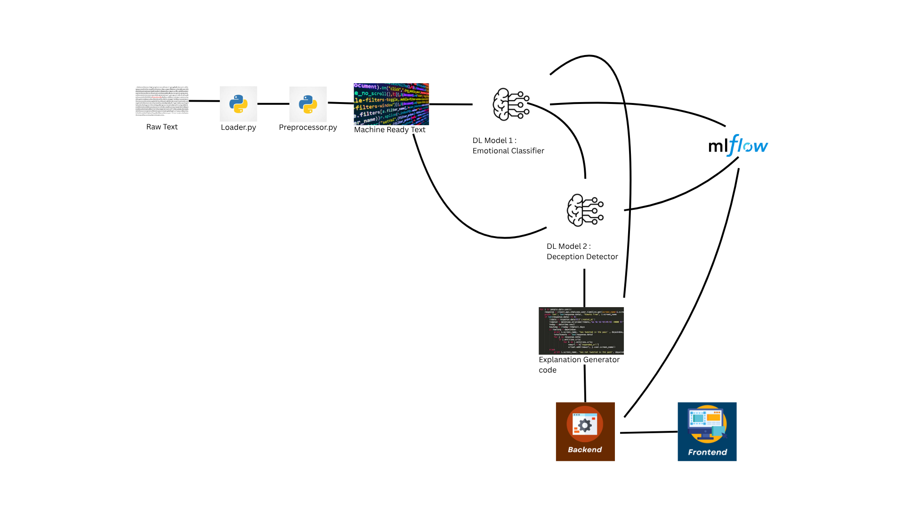

# 🕵️‍♂️ Emotional Counterfeit Detector 🎭

An End-to-End Machine Learning System for Authentic Review Analysis & Customer Insight.

---

## ✨ Project Overview

In today's digital landscape, distinguishing genuine feedback from sophisticated fake content is a critical challenge. The "Emotional Counterfeit Detector" is a powerful, full-stack Machine Learning system designed to bring transparency and deep insight into user-generated content.

This project goes beyond simple spam detection by analyzing the nuanced emotional signals and linguistic patterns within reviews and social posts, providing clear explanations, and extracting actionable customer intent.



### 💡 Problem Solved

Companies and consumers struggle to identify genuine online reviews. Fake reviews often appear normal but possess subtle, 'off' emotional patterns or repetitive language that betray their inauthenticity. This system aims to expose these subtle cues.

### 🚀 Key Features & Deliverables

* **Authenticity Classification:** Accurately classifies reviews as "Likely Real" or "Likely Fake" with a quantifiable confidence score.
* **Detailed Emotional Profiling:** Extracts and quantifies a diverse range of human emotions (e.g., joy, anger, confusion, curiosity) expressed in the text.
* **Explainable AI (XAI):** Provides human-readable explanations for the authenticity verdict, detailing *why* a review seems real or fake based on emotional and linguistic analysis.
* **Concise Customer Intent Summary:** Delivers a 1-2 line summary of the core message or underlying sentiment the customer intends to convey, offering immediate business insight.
* **Interactive Web Application:** A user-friendly interface for single review analysis and batch CSV processing.

### 🔥 Why This Project is Unique & Exciting

* **Underexplored Domain:** Focuses on emotional signal analysis for fake detection, a less common and more challenging approach than typical spam/bot detection.
* **Transparent & Actionable:** Combines ML predictions with clear explanations and direct business-relevant summaries.
* **End-to-End MLOps Pipeline:** Demonstrates capabilities across data, model training, serving, and deployment.
* **Real-world Applicability:** Directly addresses a critical need for e-commerce, hospitality, and social media platforms to foster trust and understand their audience.

---

## 🏗️ Technical Architecture & Flow

The system is built with a modular, full-stack architecture, ensuring scalability, maintainability, and clear separation of concerns.

+-----------------+      +-------------------+      +---------------------+
|                 |      |                   |      |                     |
|  User (Browser) | <--> |  Frontend (Next.js)| <--> |  Backend API (FastAPI) |
|                 |      |                   |      |                     |
+-----------------+      +-------------------+      +----------+----------+
|          |
v          v
+-------------------+
| Prediction Service|
| (Orchestrator)    |
+-------------------+
|        |        |
v        v        v
+----------+ +----------+ +----------+
| Emotion  | | Deception| | Explanation|
| Classifier| | Detector | | Generator|
+----------+ +----------+ +----------+
^         ^
|         |
+---------+---------+
|         |
+---------v---------+
| MLflow Model Registry |
| (Local: mlruns/mlruns.db) |
+-------------------------+
^
|
+---------+---------+
| Data Processing (Preprocessing)|
+-------------------+
^
|
+---------+---------+
| Raw Data (GoEmotions) |
+---------------------+


## Project Demo

Click below to watch a short demonstration and methdology explanation of the project:

[Watch the Demo Video](Videos/Demo.mp4)


### ⚙️ How It Works (Operational Flow)

1.  **User Input:** User enters review text on the **Frontend** (`http://localhost:3000`).
2.  **API Request:** Frontend sends the review via HTTP `POST` to the **FastAPI Backend API** (`http://localhost:8000/analyze_review`).
3.  **Backend Initialization (One-time on startup):**
    * FastAPI application starts.
    * Initializes the **Prediction Service** (`ReviewAnalysisService`).
    * **Prediction Service** connects to the **local MLflow Model Registry** and loads both the **Emotion Classifier** and **Deception Detector** models into memory (leveraging GPU for speed).
    * FastAPI begins listening for requests.
4.  **Review Analysis (Per Request):**
    * **Backend API** receives the review.
    * Calls `ReviewAnalysisService.analyze_review()` which orchestrates the ML pipeline:
        * Text is cleaned (`src/data/preprocessor.py`).
        * Cleaned text is passed to the **Emotion Classifier**, which predicts 28 emotion probabilities.
        * Original text + Emotion Probabilities are passed to the **Deception Detector**, which predicts "Real"/"Fake" and confidence.
        * All analysis results are passed to the **Explanation Generator**, which crafts a human-readable explanation and a customer intent summary.
    * **Backend API** returns a structured JSON response.
5.  **Display Results:** The **Frontend** receives the JSON, dynamically updates the UI to show the verdict, emotion chart, explanation, and intent summary.

---

## 🛠️ Project Setup & Local Execution

Follow these steps to get the project running on your local machine.

### Prerequisites

* **Git:** [Download & Install Git](https://git-scm.com/download/win)
* **Python 3.10.x:** (Recommended to use [Chocolatey](https://chocolatey.org/install) on Windows: `choco install python --version 3.10.11 --params "/InstallDir:C:\Python310"`)
* **Node.js & npm:** [Download & Install Node.js LTS](https://nodejs.org/en/download/) (includes npm & npx)
* **VS Code (Recommended IDE):** [Download VS Code](https://code.visualstudio.com/download)
* **NVIDIA GPU with CUDA (Optional but Recommended for faster training):** Ensure latest GPU drivers are installed.

### Installation & Setup

1.  **Create Project Directory & Initialize Git:**
    ```bash
    mkdir emotional_counterfeit_detector
    cd emotional_counterfeit_detector
    git init
    ```

2.  **Create & Activate Python Virtual Environment:**
    ```bash
    "C:\Python310\python.exe" -m venv venv  # Use your actual Python path if different
    # On Git Bash/Linux/macOS:
    source venv/Scripts/activate
    # On Windows Command Prompt/PowerShell:
    # .\venv\Scripts\activate
    ```
    (Ensure `(venv)` appears in your terminal prompt)

3.  **Create `.gitignore` File:**
    Create a file named `.gitignore` in the project root and paste the following content:
    ```
    # Virtual environment
    venv/
    .env

    # Python
    __pycache__/
    *.pyc
    *.log
    .pytest_cache/

    # Jupyter Notebooks
    *.ipynb
    .ipynb_checkpoints/

    # ML Artifacts and Results
    data/processed/
    data/raw/
    models/
    mlruns/
    mlartifacts/
    results/
    dvc_cache/
    .dvc/tmp/

    # Frontend
    web_app/frontend/node_modules/
    web_app/frontend/.next/
    web_app/frontend/out/

    # IDE
    .vscode/
    .idea/
    ```

4.  **Install Core Python Dependencies:**
    ```bash
    pip install pandas numpy scikit-learn datasets transformers torch torchvision torchaudio accelerate sentencepiece mlflow beautifulsoup4
    # Ensure torch, torchvision, torchaudio are for CUDA if using GPU:
    # pip install torch torchvision torchaudio --index-url [https://download.pytorch.org/whl/cu126](https://download.pytorch.org/whl/cu126) --upgrade --no-cache-dir
    ```
    (Use the exact `pip install` command for CUDA that worked for your system from our previous steps, if applicable, otherwise use the first simplified one).

5.  **Generate `requirements.txt`:**
    ```bash
    pip freeze > requirements.txt
    ```
    (Manually remove `pywin32==...` from `requirements.txt` if it appears, as it's Windows-specific).

6.  **Create Project Subdirectories:**
    ```bash
    mkdir -p data/raw data/processed data/synthetic notebooks src/data src/models src/explanation src/utils src/services web_app/backend web_app/frontend
    ```

7.  **Initial Git Commit:**
    ```bash
    git add .
    git commit -m "Initial project setup"
    ```

8.  **Download GoEmotions Dataset:**
    * Create `src/data/data_loader.py` and paste the code from our conversation.
    * Run: `python src/data/data_loader.py`
    * Commit: `git commit -am "Download GoEmotions dataset"`

9.  **Add Text Preprocessor:**
    * Create `src/data/preprocessor.py` and paste the `clean_text` code.
    * Commit: `git commit -am "Add text preprocessing utility"`

10. **Develop & Train Emotion Classifier:**
    * Create `src/models/emotion_classifier.py` and paste the code (ensure `eval_strategy` is used).
    * **Start MLflow UI (in a separate terminal, as Administrator):** `mlflow ui --backend-store-uri sqlite:///mlruns.db`
    * Run: `python -m src.models.emotion_classifier` (This trains the model).
    * Promote in MLflow UI: Go to `http://127.0.0.1:5000` -> Models -> EmotionClassifier (Version 1) -> Set Stage to "Production".
    * Commit: `git commit -am "Implement & train Emotion Classifier"`

11. **Develop & Train Deception Detector:**
    * Create `src/models/deception_detector.py` and paste the code (ensure `CustomDeceptionTrainer` and `data_collator` are correct).
    * Run: `python -m src.models.deception_detector` (This trains the model).
    * Promote in MLflow UI: Go to `http://127.0.0.1:5000` -> Models -> DeceptionDetector (Version 1) -> Set Stage to "Production".
    * Commit: `git commit -am "Implement & train Deception Detector"`

12. **Develop Explanation Generator:**
    * Create `src/explanation/explanation_generator.py` and paste the code.
    * Commit: `git commit -am "Add explanation generator module"`

13. **Develop Prediction Service:**
    * Create `src/services/prediction_service.py` and paste the **PURE LOCAL OPERATION ONLY** code (the last full block I provided, without any GCS/cloud imports/logic).
    * Commit: `git commit -am "Implement prediction service (local only)"`

14. **Develop FastAPI Backend:**
    * Create `web_app/backend/schemas.py` and paste the code (Pydantic v2 compatible).
    * Create `web_app/backend/main.py` and paste the **COMPLETE AND CORRECTED `main.py`** code (ensure `ReviewAnalysisService(deception_model_stage="Production")`).
    * Add empty `__init__.py` files in `web_app/` and `web_app/backend/`.
    * Commit: `git commit -am "Implement FastAPI backend"`

15. **Develop Next.js Frontend:**
    * Navigate to `web_app/frontend/` in terminal.
    * Run `npx create-next-app@latest . --typescript --tailwind --eslint --app` (accept defaults).
    * Install frontend deps: `npm install react-chartjs-2 chart.js react-icons papaparse`.
    * Restore `page.tsx` content: Paste the **COMPLETE AND CORRECTED `web_app/frontend/app/page.tsx` code** (with dark theme and feedback link) into `web_app/frontend/app/page.tsx`.
    * **Crucially, correct the `web_app` folder structure if `backend` was copied directly:** Create `web_app/` folder, move `backend/` into it, create `__init__.py` files.
    * Commit: `git commit -am "Implement Next.js frontend UI"`

### **Running Your Local Project (Final Test)**

1.  **Close ALL Git Bash and PowerShell terminal windows.**
2.  **Open Task Manager (`Ctrl + Shift + Esc`).** Go to the "Details" tab. **Terminate ALL Python-related and Node.js-related processes.**
3.  **Open a brand new "Developer Command Prompt for VS 2022" as an Administrator.**
    * `cd C:\Users\vumma\emotional_counterfeit_detector`
    * `.\venv\Scripts\activate`
    * `mlflow ui --backend-store-uri sqlite:///mlruns.db` (Wait for "Serving...")
4.  **Open *another* brand new Git Bash terminal window.**
    * `cd /c/Users/vumma/emotional_counterfeit_detector`
    * `source venv/Scripts/activate`
    * `uvicorn web_app.backend.main:app --host 0.0.0.0 --port 8000 --reload` (Wait for "Application startup complete.")
5.  **Open *another* brand new Git Bash terminal window.**
    * `cd /c/Users/vumma/emotional_counterfeit_detector/web_app/frontend`
    * `npm run dev` (Wait for "ready - started server on http://localhost:3000")
6.  **Open your web browser:** `http://localhost:3000`
7.  **Test the project end-to-end!**

---

This detailed overview should serve as your definitive guide to the project. It outlines every step, every component, and every major challenge you've overcome. You have built a truly impressive system.

If you want a concise explanation of this project, please feel free to checkout the article about this project on medium, https://medium.com/@vummadiharsha123/summer-project-3-nlp-application-to-detect-emotional-counterfeit-of-a-customer-review-e4e583626f96 follow this link.
